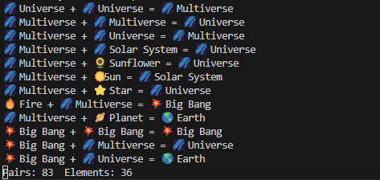

# Infinite Craft Explorer



This code simply iterates through every possible combination of elements, and saves their pairings into an SQLite database.
Additionally, it avoids pairing "numeric elements" since that typically ends up going down an endless rabbit hole of uninteresting numeric discoveries.

# How to Use
1. Install Python from https://www.python.org/
2. Download the code
3. In a terminal, `cd` into the repository
4. Install the dependencies:
    - Windows: `py -m pip install -r requirements.txt`
    - Other: `python3 -m pip install -r requirements.txt`
5. Run the code
    - Windows: `py main.py`
    - Other: `python3 main.py`
6. On the first run, enter your networking information in order to bypass the CloudFlare bot detection. See this video tutorial:


Results are printed to the console and stored in `cache.sqlite`.

# How it Works
### API Integration
The primary endpoint is `https://neal.fun/api/infinite-craft/pair` to determine the result of pairing two elements.
Cloudflare uses some smart technology to block Python-based `requests.get()` calls (even with header spoofing), so instead, this repository requires you to copy/paste the headers from your normal web browser.

### Result Persistence (Database)
Elements and Pairs are saved into two separate SQLite database tables:
```sql
CREATE TABLE IF NOT EXISTS element (
    id INTEGER PRIMARY KEY AUTOINCREMENT,
    first_created_at DATETIME DEFAULT CURRENT_TIMESTAMP,
    name TEXT UNIQUE,
    emoji TEXT
)

CREATE TABLE IF NOT EXISTS pair (
    id INTEGER PRIMARY KEY AUTOINCREMENT,
    timestamp DATETIME DEFAULT CURRENT_TIMESTAMP,
    first_element_id INTEGER,
    second_element_id INTEGER,
    result_element_id INTEGER,
    is_discovery INTEGER,
    FOREIGN KEY (first_element_id) REFERENCES element (id),
    FOREIGN KEY (second_element_id) REFERENCES element (id),
    FOREIGN KEY (result_element_id) REFERENCES element (id)
    UNIQUE(first_element_id, second_element_id)
)
```

See [`persistence.py`](./persistence.py) for specific details.

### Finding New Discoveries
To find new elements, you want to prioritize combining "specific" elements. This simply means prioritizing combination of recently produced elements.
In SQL, that looks like `ORDER BY first.id DESC, second.id DESC`. However, sometimes this produces an element _so_ specific that any combination with it
will produce "❓ Nothing". Getting stuck in this rut of producing Nothing thousands of times in a row is very annoying, so we occasionally try other elements i.e.
`ORDER BY first.id ASC, second.id ASC` or `ORDER BY first.id ASC, second.id DESC`. Specifically, we pick elements at random with this distribution:
- 80% - `ORDER BY first.id DESC, second.id DESC`
- 10% - `ORDER BY first.id ASC, second.id ASC`
- 10% - `ORDER BY first.id ASC, second.id DESC`

The exact distribution was picked arbitrarily, feel free to change it (or use a different ordering method entirely). PRs welcome to make this adjustable via CLI.

### Results
After running the script for one hour, I received the following results:
- Performed 6662 element combinations (pairs).
- Found 1421 elements.
- Discovered 154 new elements.

Here are some of my favorite New Discoveries (note that most of the ingredients required for these discoveries were also new discoveries):
- 🔥🌎🌌 Sin Multiverse + 🤖🙏 The Robot Jesus Show = 🤖 The Robot Jesus Show Multiverse
- 👨‍ Trombone Man + 🎺 Zombie Trombone = 🧟‍♂️ Zombie Trombone Man
- 🌈 Rainbow Toast + 🍞 Wasabi Toast = 🌈🍞 Rainbow Wasabi Toast
- 💒 Salvation + 🍞 Wasabi Toast = 🍞 Salvation Toast
- ⛪️ The Holy Temple Trinity + 🎭 The Sabbath Theater = 🎭 The Holy Sabbath Theater
- 🌴 Palmer + 🌲 Surfing Tree = 🏄‍♂️ Surfing Palmer
- 🏄‍♂️💰 Surfing Billionaire + 🍹 Sweet Tea Toto = 💰 Sweet Tea Billionaire
- 🏈 The Patriots + 🐟 The Sabbath Swordfish = ⚔️ The New England Swordfish
- 🔥👿👼 The Divine Comedy + 🏋️‍♂️ The Weekend Warrior = 🙏 The Divine Weekend
- 🎰 Sin City + 🌎 The Middle = ➗ Sin Average
